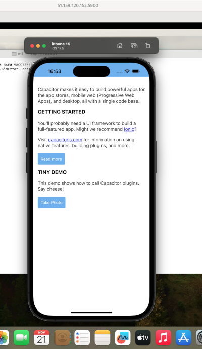

# Capacitor POC

See this note in french: https://notes.sklein.xyz/Projet%2017/

Mobile application built with Capacitor, which simply opens a *webview* that redirects to an online site (defined by `START_URL` variable environement).

## Prerequisite

- [Mise](https://mise.jdx.dev/installing-mise.html)
- yq
- java-21-openjdk

On Fedora, follow these instructions:

```sh
$ dnf install -y dnf-plugins-core
$ dnf config-manager --add-repo https://mise.jdx.dev/rpm/mise.repo
$ dnf install -y mise jq yq remmina remmina-plugins-vnc
```

## Develop the application locally, directly in a browser

To contribute to the application, you don't need to run it in an Android or iOS emulator.
You can do most of your work directly in your browser, without any additional dependencies.

```sh
$ npm install
$ START_URL=https://sklein.xyz npm run start
```

Open your browser on http://localhost:5173

Edit web application source code in [`./src/`](./src/).

## Install Capacitor requirements

### Android requirements installation

```sh
$ mise plugins install android-sdk https://github.com/Syquel/mise-android-sdk.git
$ mise install
$ rehash
$ sdkmanager --install \
    "emulator" \
    "platform-tools" \
    "build-tools;35.0.0" \
    "cmdline-tools;16.0" \
    "platforms;android-29" \
    "system-images;android-29;google_apis_playstore;x86_64"
$ avdmanager create avd \
    --name Pixel_Emulator \
    --package "system-images;android-31;google_apis_playstore;x86_64" \
    --device "pixel"
```


### iOS requirements installation on (Scaleway Apple Silicon)

```
$ cp .secret.tmpl .secret
```

Add parameters to `.secret` file.  
Reload variable env:

```sh
$ direnv allow
```

```sh
$ ./scripts/create-apple-m1.sh
$ ./scripts/enter-in-apple-m1.sh
Last login: Wed Nov 20 16:22:10 2024
m1@bb34d8ef-6305-4104-801c-1cf1b6b0f99f ~ % uname -a
Darwin bb34d8ef-6305-4104-801c-1cf1b6b0f99f 23.4.0 Darwin Kernel Version 23.4.0: Fri Mar 15 00:12:41 PDT 2024; root:xnu-10063.101.17~1/RELEASE_ARM64_T8103 arm64
```

It is also possible to connect to the server via VNC:

```sh
$ ./scripts/open-vnc.sh
```

Launches automatic installation script for iOS Capacitor requirements:

```sh
$ ./scripts/deploy-ios-requirements.sh
```

Teardown:

```sh
$ ./scripts/destroy-apple-m1.sh
```

## How to code on the project?

You can make changes in `src/`, test the application locally in a browser with `npm run start`…

Then, when you want to test your work in an iOS or Android emulator, you need to update the contents
of the `android/` and `ios/` folders with the command:

```sh
$ npm run sync
```

### Launch application on Android

#### Start Android emulator device

Before running the `npx cap run android` command, as described later in this README, you must to launch an Android terminal emulator.  
To launch this terminal, run the following command and wait about 1min for the device to be ready.

```sh
$ $ANDROID_HOME/emulator/emulator -avd Pixel_Emulator
```

#### Build and launch app mobile in Android emulator

```sh
$ npm install
$ npm run sync
$ npx cap run android
```

### Launch application on iOS

```sh
$ ./scripts/upload-project-to-apple-m1.sh
```

#### Start iOS emulator device

```sh
$ ./scripts/enter-in-apple-m1.sh
$ export DEVICE_UDID=$(xcrun simctl list devices -j | jq -r '.devices["com.apple.CoreSimulator.SimRuntime.iOS-17-5"][] | select(.name == "iPhone 15") | .udid')
$ xcrun simctl boot $DEVICE_UDID
```
#### Build and launch app mobile in iOS emulator

```sh
$ ./scripts/enter-in-apple-m1.sh
$ cd projet
$ mise install
$ npm install
$ npm run sync
$ npx cap run ios --target="${DEVICE_UDID}"
```

See device simulator in VNC:

```sh
$ ./scripts/open-vnc.sh
```



#### What should I do if I've modified the source code on my workstation?

On your workstation, execute:

```sh
$ ./scripts/upload-project-to-apple-m1.sh
```

In *apple-m1 server*, execute:

```
$ npm install # optional
$ npm run sync
$ npx cap run ios --target="${DEVICE_UDID}"
```
