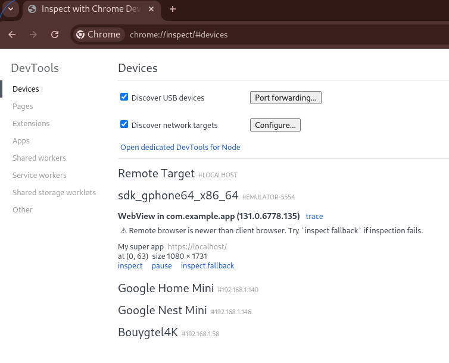

# Capacitor POC

See this note in french: https://notes.sklein.xyz/Projet%2017/

Mobile application built with Capacitor, which simply opens a *webview* that redirects to an online site (defined by `START_URL` variable environement).

The Capacitor application in this POC displays the content of a demonstration website, with the HTML content located in the `./dummy-website/` folder.  
This website is served by an HTTP Nginx server, launched using `docker-compose.yml`.

## Prerequisite

- [Mise](https://mise.jdx.dev/installing-mise.html)
- yq
- java-21-openjdk

On Fedora, follow these instructions:

```sh
$ dnf install -y dnf-plugins-core
$ dnf config-manager --add-repo https://mise.jdx.dev/rpm/mise.repo
$ dnf install -y mise jq yq remmina remmina-plugins-vnc
```

## Start dummy website http server

Starting the Nginx service:

```sh
$ docker compose up -d --wait
```

## Expose dummy website on Internet

Why?  
The Android and iOS emulators do not have direct and easy access to the HTTP service (dummy website) exposed on `http://localhost:8080`.

To overcome this issue, I use [`cloudflared tunnel`](https://developers.cloudflare.com/cloudflare-one/connections/connect-networks/get-started/create-local-tunnel/).  
You can also use other solutions, such as [Sish](https://docs.ssi.sh/) or [ngrok Developer Preview](https://ngrok.com/use-cases/developer-preview).  
For more information, you can refer to the following note (in French): https://notes.sklein.xyz/2025-01-06_2105/zen/

```sh
$ ./scripts/start-cloudflare-http-tunnel.sh
Starting the tunnel...
…wait… …wait… …wait…
Tunnel started successfully: https://moral-clause-interesting-broadway.trycloudflare.com
```

Next, load the environment variables that will be used by capacitor to find out where the site to be shown is?

```
$ source ./scripts/load-variables.sh
Variables loaded:

START_URL=https://moral-clause-interesting-broadway.trycloudflare.com
ALLOW_NAVIGATION=moral-clause-interesting-broadway.trycloudflare.com
```

To stop the tunnel, you can execute:

```sh
$ ./scripts/stop-cloudflare-http-tunnel.sh
Stopping the tunnel (PID: 673143)...
Tunnel stopped successfully.
```

## Develop the application locally, directly in a browser

To contribute to the application, you don't need to run it in an Android or iOS emulator.
You can do most of your work directly in your browser, without any additional dependencies.

```sh
$ npm install
$ npm run start
```

Open your browser on http://localhost:5173

Edit web application source code in [`./src/`](./src/).

## Install Capacitor requirements

### Android requirements installation

```sh
$ mise install
$ rehash
$ sdkmanager --install \
    "emulator" \
    "platform-tools" \
    "build-tools;35.0.0" \
    "cmdline-tools;16.0" \
    "platforms;android-29" \
    "system-images;android-31;google_apis_playstore;x86_64"
$ avdmanager create avd \
    --name Pixel_Emulator \
    --package "system-images;android-31;google_apis_playstore;x86_64" \
    --device "pixel"
```


### iOS requirements installation on (Scaleway Apple Silicon)

```
$ cp .secret.tmpl .secret
```

Add parameters to `.secret` file.  
Reload variable env:

```sh
$ direnv allow
```

```sh
$ ./scripts/create-apple-m1.sh
$ ./scripts/enter-in-apple-m1.sh
Last login: Wed Nov 20 16:22:10 2024
m1@bb34d8ef-6305-4104-801c-1cf1b6b0f99f ~ % uname -a
Darwin bb34d8ef-6305-4104-801c-1cf1b6b0f99f 23.4.0 Darwin Kernel Version 23.4.0: Fri Mar 15 00:12:41 PDT 2024; root:xnu-10063.101.17~1/RELEASE_ARM64_T8103 arm64
```

It is also possible to connect to the server via VNC:

```sh
$ ./scripts/open-vnc.sh
```

Launches automatic installation script for iOS Capacitor requirements:

```sh
$ ./scripts/deploy-ios-requirements.sh
```

Teardown:

```sh
$ ./scripts/destroy-apple-m1.sh
```

## How to code on the project?

You can make changes in `src/`, test the application locally in a browser with `npm run start`…

Then, when you want to test your work in an iOS or Android emulator, you need to update the contents
of the `android/` and `ios/` folders with the command:

```sh
$ npm run sync
```

### Launch application on Android

#### Start Android emulator device

Before running the `npx cap run android` command, as described later in this README, you must to launch an Android terminal emulator.  
To launch this terminal, run the following command and wait about 1min for the device to be ready.

```sh
$ $ANDROID_HOME/emulator/emulator -avd Pixel_Emulator
```

#### Build and launch app mobile in Android emulator

```sh
$ npm install
$ npm run build
$ npm run sync
$ npx cap run android
```

### Launch application on iOS

```sh
$ ./scripts/upload-project-to-apple-m1.sh
```

#### Start iOS emulator device

```sh
$ ./scripts/enter-in-apple-m1.sh
$ export DEVICE_UDID=$(xcrun simctl list devices -j | jq -r '.devices["com.apple.CoreSimulator.SimRuntime.iOS-17-5"][] | select(.name == "iPhone 15") | .udid')
$ xcrun simctl boot $DEVICE_UDID
```
#### Build and launch app mobile in iOS emulator

```sh
$ ./scripts/enter-in-apple-m1.sh
$ cd projet
$ mise install
$ npm install
$ npm run build
$ npm run sync
$ npx cap run ios --target="${DEVICE_UDID}"
```

See device simulator in VNC:

```sh
$ ./scripts/open-vnc.sh
```


#### What should I do if I've modified the source code on my workstation?

On your workstation, execute:

```sh
$ ./scripts/upload-project-to-apple-m1.sh
```

In *apple-m1 server*, execute:

```
$ npm install # optional
$ npm run sync
$ npx cap run ios --target="${DEVICE_UDID}"
```

### Tips and tricks

#### How to regenerate `android` and `ios` folders

If you're updating the `@capacitor/android` or `@capacitor/ios` packages, I think it's a good idea to regenerate the `android` and `ios` folders:

```sh
$ rm -rf android
$ npx cap add android
```

```sh
$ rm -rf ios
$ npx cap add ios
```

#### How to regenerate Logo assets?

To change the application logo, you can edit the files in `./assets/`.

Then run the following command:

```sh
$ npx capacitor-assets generate
```

This command generates all assets in the following folders:

- `./android/app/src/main/res/`
- `./ios/App/App/Assets.xcassets/`
- `./src/assets/`

For more information, see: https://github.com/ionic-team/capacitor-assets

#### How to View console.log Messages in the Android Emulator?

Open `` in Chrome, and you see:



Click "inspect" on "My supper app".

Then you can inspect the Capacitor application running in the emulator, just as you would with a conventional website.

`adb logcat` is a valuable tool for debugging as it provides access to the complete event logs of the Android emulator.
It offers a detailed view of the system logs, which can be useful for diagnosing issues and monitoring the behavior of the application.

#### Android package management

List packages installed in the Android emulator:

```sh
$ adb shell pm list packages
...
```

Uninstall a package:

```sh
$ adb uninstall xyz.sklein.myapp
```
